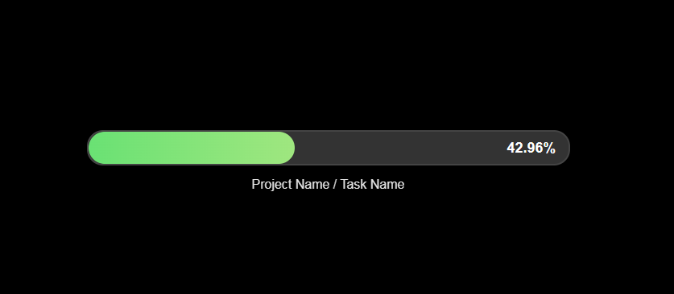

# 🎯 Goalmeter

A powerful project tracking tool that seamlessly transforms your task lists into interactive checklists with real-time progress monitoring. Download Goalmeter New Tab Page Extension for Google Chrome or Brave [Goalmeter Extension](https://github.com/bhu1st/goalmeterext)



## 📋 Features

### Dynamic Toggle Functionality
- **Text Editor ↔️ Checklist Toggle**
  - Transform your text editor into an interactive checklist with a single click
  - Switch between "Edit Tasks" and "Task Checklist" modes effortlessly
  - All data syncs perfectly between views

### Interactive Checklist
- Check/uncheck tasks directly in the checklist view
- Real-time updates to:
  - Local storage data
  - Progress percentage calculation
  - Main progress bar
  - Project information display

### Visual Styling
- Main tasks appear in **bold**
- Subtasks are indented for clear hierarchy
- Completed tasks show with ~~strikethrough text~~
- Project titles highlighted in green for easy identification

### Seamless Workflow
- Type tasks in markdown-like format in the editor
- Toggle to checklist view with "Save Progress"
- Mark tasks complete/incomplete with interactive checkboxes
- Return to editing with "Edit Tasks" button

## 🚀 Getting Started

### Prerequisites
- Modern web browser with JavaScript enabled
- LocalStorage support

### Installation
1. Clone the repository:
   ```bash
   git clone https://github.com/bhu1st/goalmeter.git
   cd goalmeter
   ```

2. Open `index.html` in your browser or host on your preferred web server.

### Usage
1. **Creating a Project**:
   - Enter project title
   - Add tasks in the text editor using the markdown-like format:
     ```
     Main Task 1
     - Subtask 1.1
     - Subtask 1.2
     
     Main Task 2
     - Subtask 2.1
     ```
   - Click "Save Progress"

2. **Tracking Progress**:
   - Use the checklist view to mark tasks as complete
   - Watch the progress bar update in real-time
   - Return to editing anytime with "Edit Tasks"

3. **Data Persistence**:
   - All data is automatically saved to localStorage
   - Your projects persist across browser sessions

## 🔧 Technical Implementation

### Data Flow
- Text editor content → Parsed task structure → LocalStorage → Interactive checklist
- Checkbox interactions → Updated task structure → LocalStorage → Updated progress metrics

### Storage Format
Tasks are stored in the following structure:
```javascript
{
  title: "Project Name",
  tasks: [
    {
      text: "Main Task 1",
      completed: false,
      subtasks: [
        { text: "Subtask 1.1", completed: false },
        { text: "Subtask 1.2", completed: true }
      ]
    },
    // Additional tasks...
  ],
  progress: 25 // Percentage complete
}
```

## 📝 License

This project is licensed under the MIT License - see the [LICENSE](LICENSE) file for details.

## 🤝 Contributing

Contributions are welcome! Please feel free to submit a Pull Request.

1. Fork the repository
2. Create your feature branch (`git checkout -b feature/amazing-feature`)
3. Commit your changes (`git commit -m 'Add some amazing feature'`)
4. Push to the branch (`git push origin feature/amazing-feature`)
5. Open a Pull Request

## 🙏 Acknowledgments

- Inspired by productivity systems like GTD (Getting Things Done)
- Built with vanilla JavaScript, HTML, and CSS for maximum compatibility

---

Made with ❤️ by [Bhupal Sapkota at Berkeley Computer]